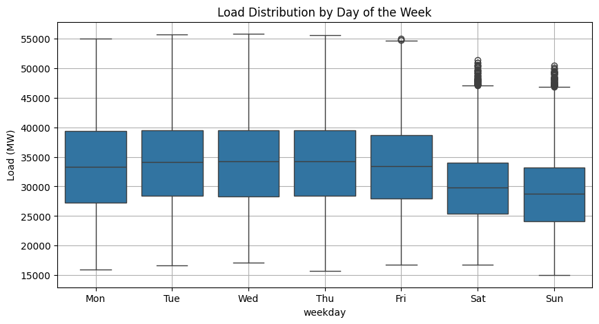
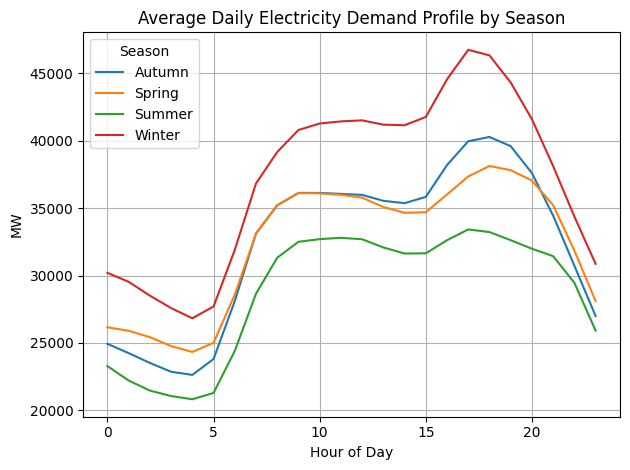
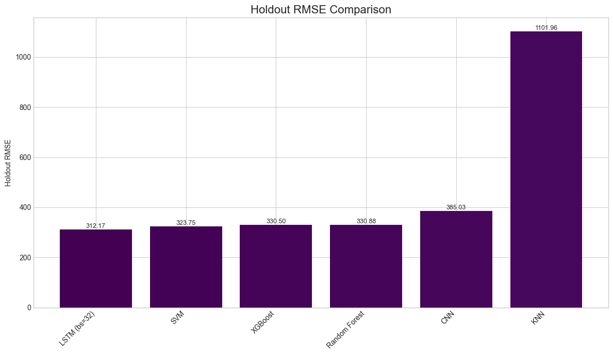
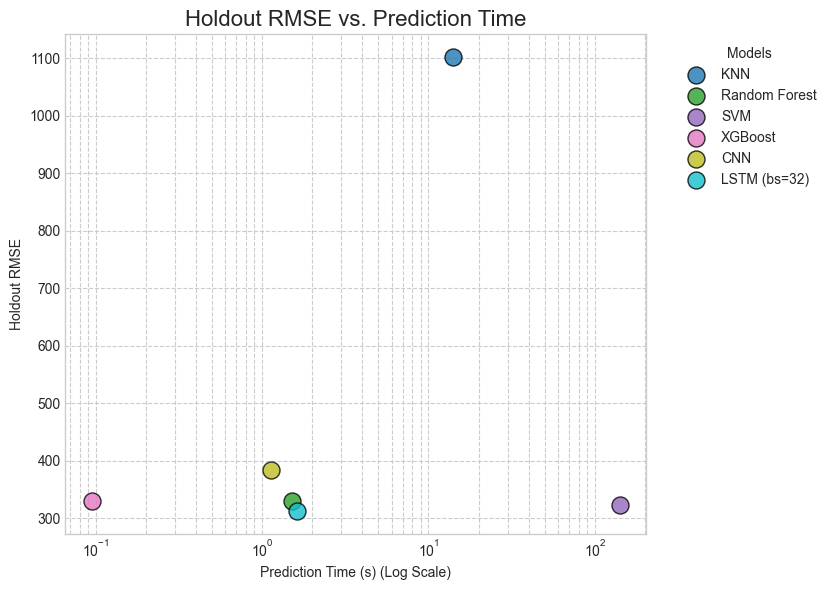
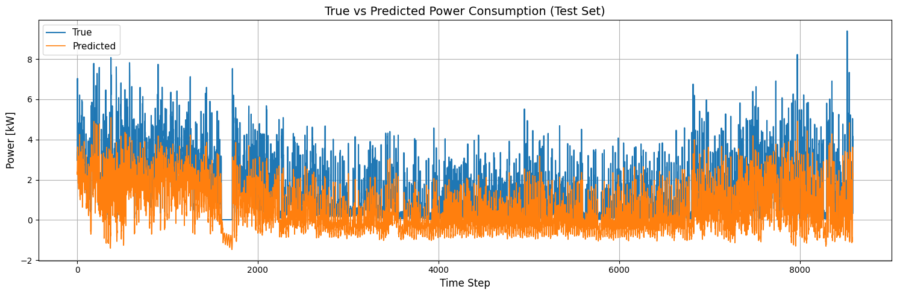

# Technical Report: Energy Demand Forecasting Pipeline

This document summarizes the methodology and technical choices made in constructing a forecasting pipeline for UK national energy demand. The focus is on the specific challenges of time-series data and the solutions implemented to address them.

### 1. Data Preparation and Cleaning

* **Problem:** The raw data exhibited time-based discontinuities, particularly around daylight saving time changes, resulting in duplicate or missing timestamps. This made reliable sequential analysis impossible.
* **Solution:**
    1.  A systematic **resampling** (`resample('30min').asfreq()`) was applied to enforce a perfectly regular time index with a 30-minute frequency.
    2.  This operation introduced `NaN` values where data was missing. These gaps were then filled using **time-based interpolation** (`.interpolate(method='time')`), a more robust method for time-series data than simple mean-filling.

### 2. Exploratory Data Analysis (EDA)

* **Problem:** Before building models, it was essential to understand the underlying patterns and seasonalities in the data to guide the creation of relevant features.
* **Solution:**
    1.  A detailed visual analysis was conducted in the `NESO_UK_Visualization.ipynb` notebook.
    2.  This analysis revealed:
        * Strong **daily seasonality** (two consumption peaks) and **weekly seasonality** (a drop in demand on weekends).
        * Distinct consumption profiles between weekdays and weekends.
        * A pronounced **annual seasonality**, with higher demand in winter.
    3.  These observations directly justified the feature engineering choices made in the next step.

### 3. Feature Engineering

* **Problem:** The raw time series lacks explicit indicators that machine learning models can use to capture the trends and cycles observed during the EDA.
* **Solution:** A two-step process was applied to enrich the data.

    #### A. Raw Feature Creation (`build_features.py`)
    * **Calendar Features:** To decompose the time index, the following were extracted: `hour`, `weekday`, `month`, 
    * **Weekend Indicator:** A binary `is_weekend` feature was created to explicitly capture different consumption patterns.
    * **Lag Features:** To provide historical context, past demand values were added: `I014_ND_lag_1`, `I014_ND_lag_2`, `I014_ND_lag_48`, `I014_ND_lag_96`, `I014_ND_lag_336`
    * **Rolling Features:** To smooth short-term trends, a 24-hour rolling average was calculated: `rolling_mean_48`.

    #### B. Feature Transformation (`preprocessing_NESO_UK.py`)
    * **Problem:** Numerical calendar features are misinterpreted by models (e.g., for the `hour` feature, 23 is numerically distant from 0).
    * **Solution:** Cyclical features were transformed into Cartesian coordinates (sin/cos) to preserve their periodic nature.
    * **Transformed Features:** `hour`, `weekday`, `month`,  were each converted into their `_sin` and `_cos` counterparts. The original columns were then dropped to avoid redundancy.

### 4. Data Structuring for Models

* **Problem:** Ensuring consistency and preventing data leakage when preparing data for each model.
* **Solution:** A `DataHandler` class was developed to automate **strict temporal splitting** (data before 2017 for training, 2018 for testing) and **feature scaling** (`StandardScaler` fitted only on training data).

### 5. Model Architecture and Implementation

* **Problem:** The enriched data contains two types of information: **sequential** (lags) and **static** (calendar features). A standard model cannot optimally process both types.
* **Solution:** A diverse range of models was implemented to compare their performance.
    * **Classical Models:**
        * K-Nearest Neighbors (`KNN`)
        * Support Vector Machine (`SVM`)
        * Random Forest (`RandomForest`)
    * **Gradient Boosting Model:**
        * `XGBoost`
    * **Deep Learning Models:**
        * `CNN` (Convolutional Neural Network)
        * `LSTM` (Long Short-Term Memory)
* **Note on `CNN`/`LSTM` Architecture:** These two models were designed with a **dual-input architecture**. One branch processes sequential data (lags) with specialized layers (`Conv1D` or `LSTM`), while a second branch handles static data (calendar features) with standard dense layers. The outputs of both branches are then merged before the final prediction, allowing the model to best leverage each type of information.

### 6. Model Training and Evaluation

* **Problem:** Standard K-Fold cross-validation is invalid for time-series data as it does not respect chronological order. Furthermore, training some models can be computationally expensive.
* **Solution:**
    * **Hyperparameter Optimization:** For the `KNN`, `RandomForest`, `XGBoost`, and `SVM` models, an exhaustive hyperparameter search (`GridSearchCV`) was performed using `TimeSeriesSplit`, a cross-validation strategy appropriate for time-series data.
    * **Specific Strategy for `SVM`:** Due to the model's very long training time, a pragmatic approach was taken:
        1.  The `GridSearchCV` was first run on a smaller subset of data, corresponding to **two years of training history**.
        2.  Once the optimal parameters (`C`, `gamma`, `epsilon`, `kernel` ) were identified, a **new `SVM` model was re-trained on the entire 7-year training dataset** using this optimal configuration.
    * **Final Evaluation:** All models, including the final `SVM`, were evaluated on the hold-out test set (the year 2017) using metrics for accuracy (`RMSE`, `MAE`, `MAPE`) and efficiency (`test_pred_time_s`).

### 7. Results

The final performance of all models on the holdout test set is summarized in the charts below. The metrics used are Mean Absolute Error (MAE), Root Mean Squared Error (RMSE), and the trade-off between RMSE and prediction time.

#### A. Accuracy Comparison (MAE and RMSE)

The bar charts show a clear performance hierarchy.
* The `LSTM`, `Random Forest`, `XGBoost`, and `SVM` models form a top tier, achieving significantly lower error rates than the others. Their MAE values are all below 250, and their RMSE values are around 330.
* The `CNN` model performs moderately well, positioned between the top tier and the `KNN` model.
* The `KNN` model is a clear outlier, with dramatically higher MAE (819.37) and RMSE (1101.96), indicating its unsuitability for this specific forecasting task.

#### B. Performance vs. Prediction Time Trade-off

This scatter plot visualizes the crucial balance between predictive accuracy (Holdout RMSE) and computational efficiency (Prediction Time).

* **High Performance, Fast Prediction:** `Random Forest` and `XGBoost` offer an excellent compromise, providing top-tier accuracy with very fast prediction times (around 1-2 seconds).
* **High Performance, Slow Prediction:** The `SVM` model, while being very accurate, is computationally expensive, taking over 100 seconds for prediction. The `LSTM` model also offers high accuracy but at a slower pace than the tree-based ensembles.
* **Low Performance:** The `KNN` model is not only the least accurate but also relatively slow compared to the best-performing models.

This analysis suggests that for a production environment where both accuracy and speed are critical, **`XGBoost`, `Random Forest` and `lstm` represent the most balanced and effective solutions.**

### 8. Apartment-Level Forecasting Pipeline

This section outlines the end-to-end process used to predict the **hourly electricity consumption** of an individual apartment, starting from raw data and leveraging both classical and deep learning models.

#### A. Objective

To forecast an apartment’s electricity demand based on its historical consumption and temperature data, while incorporating key time-based patterns (hour, weekday, month, etc.).

---

#### B. Data Preparation Pipeline

1. **Cleaning and Merging (`clean_and_merge_power_weather.py`)**

   * Raw electricity usage data (2014–2016) is cleaned: duplicates are removed, and missing values are interpolated.
   * These time series are then merged with hourly weather data (temperature).
   * **Output:** One continuous time-series `.csv` file per apartment.

2. **Feature Engineering (`build_features_UMass.py`)**

   * Adds calendar-based features: `hour`, `month`, `weekday`, `is_weekend`.
   * Generates historical lag features (`power_lag_1`, `power_lag_24`, `power_lag_168`) to provide temporal context.
   * **Output:** One enriched dataset per apartment.

3. **Cyclical Encoding (`preprocessing_UMass.py`)**

   * Calendar features (`hour`, `weekday`, `month`) are transformed into cyclical form using sine and cosine functions.
   * **Output:** Fully preprocessed datasets ready for model training.

4. **Aggregation and Splitting (`aggregate_and_split_apartment_data.py`)**

   * All apartment datasets are merged into a single training set.
   * One apartment (e.g., `Apt1` in 2016) is held out as an **independent test set** to evaluate generalization on unseen units.

#### C. Trained Models and Input Features

Two forecasting models were trained and evaluated on the apartment data:

1. **LSTM (Long Short-Term Memory neural network)**

   * **Sequential input:**

     * Past consumption lags:
       `power [kW]_lag_1`, `power [kW]_lag_24`, `power [kW]_lag_168`
     * External variable:
       `temperature`
   * **Static input:**

     * Cyclically encoded time features:
       `hour_sin`, `hour_cos`, `weekday_sin`, `weekday_cos`, `month_sin`, `month_cos`

       * binary feature `is_weekend`

2. **XGBoost (Extreme Gradient Boosting)**

   * **Input features:**

     * `temperature`, `hour_sin`, `hour_cos`, `weekday_sin`, `weekday_cos`, `month_sin`, `month_cos`, `is_weekend`

Each model was trained on a multi-apartment dataset and tested on a holdout apartment (`Apt1`, 2016).

---

### 🔍 General Analysis – LSTM Forecast on Apartment Test Set

  

This plot displays the **true vs predicted hourly power consumption** for an apartment over the full test period (\~9000 time steps, likely covering one year).

---

### 🧠 Key Observations

#### 1. ✅ **Global Seasonality Captured**

* The LSTM model successfully captures the **long-term seasonal trend**:

  * **Higher consumption** at the beginning and end (likely winter).
  * **Lower consumption** in the middle section (probably summer).
* This confirms that the model has learned the **overall shape and temporal rhythm** of the apartment’s demand profile.

#### 2. 🔁 **Day-to-Day Dynamics Approximated**

* The predicted curve follows the **general fluctuations** of the true demand curve.
* Peaks and valleys occur at the **right moments**, suggesting that the model has internalized some **daily or weekly cycles**.

#### 3. ⚠️ **Systematic Underestimation of Peaks**

* The predicted values rarely exceed **3 kW**, while actual consumption often reaches **5–8 kW**.
* This indicates that the model tends to **smooth out sharp peaks**

#### 4. 🧯 **No Instability or Noise**

* The predictions remain stable and realistic throughout.
* There are **no erratic spikes or drops**, which suggests the model is **robust** and not overfitting.

